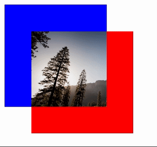
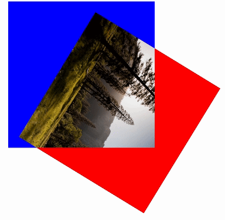

# OverlapJs
OverlapJs is a lightweight and versatile npm package designed to seamlessly blend and overlap two HTML div elements, allowing you to effortlessly integrate images or colors into the overlapping areas.



## Features
- Intersection Detection: Quickly determine if two elements overlap on the web page.
- Overlap Fill: Seamlessly fill the intersecting area of two elements with customizable content.
- Ease of Use: Straightforward API for integrating overlap detection and filling into your web projects.
- Flexibility: Customize the appearance and behavior of the filled overlap to suit your needs.
- Lightweight: Minimal overhead ensures optimal performance.

## Installation
You can install OverlapJs via npm:
``npm install overlap-js``

## Usage
Using OverlapJs in your TypeScript project is straightforward:

1. Create a container element where you want the overlapping to happen. In this element, add a top div and a bottom div.
```html
<div class="overlap-container">
    <div class="overlap-bottom"></div>
    <div class="overlap-top"></div>
</div>
```

2. Import the library:
```typescript
import { Overlap } from 'overlap-js';
```

3. Create an instance of Overlap and specify the config object:
```typescript
 new Overlap({
    container: '.overlap-container',
    topElement: '.overlap-top',
    bottomElement: '.overlap-bottom',
    overlapStyle: {
        backgroundSize: 'cover',
        backgroundRepeat: 'no-repeat',
        backgroundImage: 'url(https://source.unsplash.com/random/300×300?nature)'
    },
    overlapClass: 'bg-purple'
});
```



## Contributing
Contributions are welcome! Feel free to open issues or submit pull requests on the GitHub repository.

## License
OverlapJs is licensed under the ISC License.

## Currenly not supported
- Scale on top and bottom element. If you want to use css scale, you can scale the container element
